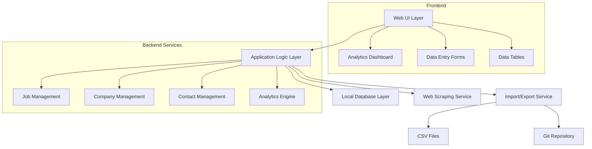

# Design Document

## Overview

The Personal Job Search Tracker is designed as a single-page web application with local data storage, optimized for desktop and tablet use. The architecture prioritizes simplicity, speed, and data portability while providing rich analytics and relationship management capabilities.

## Architecture

### High-Level Architecture



### Technology Stack

**Frontend:**

- **Framework:** Vue 3 with Composition API and TypeScript for type safety and reactive components
- **Styling:** Tailwind CSS for rapid, responsive UI development
- **State Management:** Pinia for intuitive, type-safe state management
- **Charts:** Chart.js with vue-chartjs for analytics visualizations
- **Forms:** VeeValidate with Zod validation for robust form handling
- **Tables:** Custom Vue table components with virtual scrolling for performance
- **Keyboard Shortcuts:** Vue composables for power user efficiency

**Backend/Data Layer:**

- **Database:** SQLite with better-sqlite3 for fast, local data storage
- **ORM:** Drizzle ORM for type-safe database operations
- **Web Scraping:** Playwright for reliable job posting data extraction
- **File Processing:** Papa Parse for CSV import/export
- **Git Integration:** Simple-git for backup repository management

**Desktop Application:**

- **Runtime:** Electron for cross-platform desktop deployment
- **Development:** Vite for fast development and building
- **Auto-Updates:** electron-updater for seamless version management

## Components and Interfaces

### Core Data Models

```typescript
// Job entity with full tracking capabilities
interface Job {
  id: string;
  jobTitle: string;
  companyId: string;
  jobUrl?: string;
  applicationUrl?: string;
  department?: string;
  jobType: JobType;
  seniorityLevel: SeniorityLevel;
  salaryMin?: number;
  salaryMax?: number;
  location: string;
  datePosted?: Date;
  dateSaved: Date;
  dateApplied?: Date;
  deadline?: Date;
  status: JobStatus;
  rejectionDate?: Date;
  rejectionStage?: string;
  excitementLevel: number; // 1-5
  notes?: string;
  followUpDate?: Date;
  source: JobSource;
}

// Company entity with research data
interface Company {
  id: string;
  name: string;
  industry?: string;
  size?: CompanySize;
  type?: CompanyType;
  location?: string;
  website?: string;
  linkedinUrl?: string;
  yearFounded?: number;
  excitementLevel: number; // 1-5
  glassdoorRating?: number;
  notes?: string;
}

// Contact entity for networking
interface Contact {
  id: string;
  fullName: string;
  companyId?: string;
  jobTitle?: string;
  location?: string;
  linkedinUrl?: string;
  email?: string;
  phone?: string;
  relationship: ContactRelationship;
  goal: ContactGoal;
  status: ContactStatus;
  followUpDate?: Date;
  notes?: string;
}
```

### Service Layer Architecture

**JobService:**

- CRUD operations for job management
- Status tracking with automatic timestamping
- URL scraping integration
- Relationship management with companies and contacts

**CompanyService:**

- Company data management
- Auto-creation when adding jobs
- Research data aggregation

**ContactService:**

- Contact relationship management
- Integration with job and company entities

**AnalyticsService:**

- Real-time metric calculations
- Pipeline analysis
- Trend identification
- Export data preparation

**ScrapingService:**

- Job posting URL analysis
- Field extraction (title, company, location, salary)
- Error handling for failed scrapes
- Rate limiting and respectful scraping

### User Interface Components

**Layout Components:**

- `AppShell`: Main application container with navigation
- `Sidebar`: Navigation and quick actions
- `Header`: Search, filters, and user actions

**Data Entry Components:**

- `JobForm`: Comprehensive job entry with validation
- `QuickAddDialog`: Streamlined job addition
- `CompanyForm`: Company information management
- `ContactForm`: Contact relationship tracking

**Display Components:**

- `JobTable`: Sortable, filterable job listings
- `CompanyCard`: Company overview with key metrics
- `ContactCard`: Contact information and interaction history
- `StatusPipeline`: Visual pipeline representation

**Analytics Components:**

- `DashboardOverview`: Key metrics and trends
- `PipelineChart`: Status distribution visualization
- `TimelineChart`: Application activity over time
- `ConversionFunnel`: Success rate analysis

## Data Models

### Database Schema

```sql
-- Jobs table with comprehensive tracking
CREATE TABLE jobs (
  id TEXT PRIMARY KEY,
  job_title TEXT NOT NULL,
  company_id TEXT NOT NULL,
  job_url TEXT,
  application_url TEXT,
  department TEXT,
  job_type TEXT NOT NULL,
  seniority_level TEXT NOT NULL,
  salary_min INTEGER,
  salary_max INTEGER,
  location TEXT NOT NULL,
  date_posted DATE,
  date_saved DATE NOT NULL DEFAULT CURRENT_TIMESTAMP,
  date_applied DATE,
  deadline DATE,
  status TEXT NOT NULL,
  rejection_date DATE,
  rejection_stage TEXT,
  excitement_level INTEGER NOT NULL CHECK (excitement_level BETWEEN 1 AND 5),
  notes TEXT,
  follow_up_date DATE,
  source TEXT NOT NULL,
  FOREIGN KEY (company_id) REFERENCES companies(id)
);

-- Companies table with research data
CREATE TABLE companies (
  id TEXT PRIMARY KEY,
  name TEXT NOT NULL UNIQUE,
  industry TEXT,
  size TEXT,
  type TEXT,
  location TEXT,
  website TEXT,
  linkedin_url TEXT,
  year_founded INTEGER,
  excitement_level INTEGER NOT NULL DEFAULT 3 CHECK (excitement_level BETWEEN 1 AND 5),
  glassdoor_rating REAL,
  notes TEXT
);

-- Contacts table for networking
CREATE TABLE contacts (
  id TEXT PRIMARY KEY,
  full_name TEXT NOT NULL,
  company_id TEXT,
  job_title TEXT,
  location TEXT,
  linkedin_url TEXT,
  email TEXT,
  phone TEXT,
  relationship TEXT NOT NULL,
  goal TEXT NOT NULL,
  status TEXT NOT NULL,
  follow_up_date DATE,
  notes TEXT,
  FOREIGN KEY (company_id) REFERENCES companies(id)
);

-- Job-Contact relationships
CREATE TABLE job_contacts (
  job_id TEXT NOT NULL,
  contact_id TEXT NOT NULL,
  relationship_type TEXT NOT NULL,
  PRIMARY KEY (job_id, contact_id),
  FOREIGN KEY (job_id) REFERENCES jobs(id) ON DELETE CASCADE,
  FOREIGN KEY (contact_id) REFERENCES contacts(id) ON DELETE CASCADE
);

-- Status change history for analytics
CREATE TABLE job_status_history (
  id TEXT PRIMARY KEY,
  job_id TEXT NOT NULL,
  old_status TEXT,
  new_status TEXT NOT NULL,
  changed_at TIMESTAMP NOT NULL DEFAULT CURRENT_TIMESTAMP,
  notes TEXT,
  FOREIGN KEY (job_id) REFERENCES jobs(id) ON DELETE CASCADE
);
```

### Data Relationships

- **Jobs ↔ Companies**: Many-to-one relationship (multiple jobs per company)
- **Contacts ↔ Companies**: Many-to-one relationship (multiple contacts per company)
- **Jobs ↔ Contacts**: Many-to-many relationship via job_contacts junction table
- **Jobs ↔ Status History**: One-to-many relationship for audit trail

## Error Handling

### Application-Level Error Handling

**Database Errors:**

- Connection failures: Graceful degradation with local caching
- Constraint violations: User-friendly validation messages
- Data corruption: Automatic backup restoration prompts

**Web Scraping Errors:**

- Network failures: Retry logic with exponential backoff
- Parsing failures: Fallback to manual entry with pre-filled URL
- Rate limiting: Respectful delays and user notifications

**Import/Export Errors:**

- File format issues: Detailed validation reports
- Data mapping conflicts: Interactive resolution interface
- Backup failures: Multiple backup strategy options

### User Experience Error Handling

**Form Validation:**

- Real-time validation with clear error messages
- Field-level feedback for immediate correction
- Bulk validation summaries for complex forms

**Data Integrity:**

- Duplicate detection with merge/skip options
- Relationship validation before deletion
- Orphaned record cleanup with user confirmation

## Testing Strategy

### Unit Testing

- **Data Models:** Validation logic and business rules
- **Services:** CRUD operations and data transformations
- **Utilities:** Scraping, import/export, and analytics functions
- **Components:** Form validation and user interactions

### Integration Testing

- **Database Operations:** Full CRUD workflows with relationships
- **Import/Export:** Roundtrip data integrity verification
- **Scraping Service:** Real-world job posting extraction
- **Analytics Engine:** Metric calculation accuracy

### Manual Testing Scenarios

- **Data Entry Workflows:** Complete job addition and status tracking
- **Analytics Accuracy:** Verify dashboard metrics against raw data
- **Import/Export:** Test with real CSV data from existing tools
- **Performance:** Large dataset handling (5000+ jobs)
- **Cross-Platform:** Desktop application on Windows, macOS, Linux

### Performance Testing

- **Database Performance:** Query optimization for large datasets
- **UI Responsiveness:** Table rendering with thousands of records
- **Memory Usage:** Long-running application stability
- **Startup Time:** Application initialization benchmarks

## Performance Optimization

### Database Performance

- **Indexing Strategy:** Indexes on frequently queried fields (status, company_id, date_applied)
- **Query Optimization:** Prepared statements and efficient joins for analytics
- **Pagination:** Virtual scrolling for large job lists (5000+ records)
- **Caching:** In-memory caching of computed analytics metrics

### UI Performance

- **Virtual Scrolling:** Handle large datasets without DOM bloat
- **Debounced Search:** Prevent excessive filtering during typing
- **Lazy Loading:** Load analytics charts only when dashboard is viewed
- **Optimistic Updates:** Immediate UI feedback before database confirmation

### Memory Management

- **Connection Pooling:** Efficient SQLite connection management
- **Garbage Collection:** Proper cleanup of React components and event listeners
- **Asset Optimization:** Code splitting and tree shaking for smaller bundles

## Motivation and Progress Features

### Progress Visualization

- **Pipeline Funnel:** Visual representation of conversion rates between stages
- **Streak Tracking:** Days with application activity to maintain momentum
- **Goal Setting:** Weekly/monthly application targets with progress indicators
- **Milestone Celebrations:** Visual feedback for reaching application milestones

### Rejection Analysis

- **Pattern Recognition:** Identify common rejection stages and timing
- **Company Feedback:** Track rejection reasons and feedback for learning
- **Improvement Suggestions:** Data-driven recommendations based on patterns
- **Success Rate Trends:** Track improvement over time

### Motivational Dashboard Elements

- **Activity Heatmap:** GitHub-style calendar showing daily job search activity
- **Success Stories:** Highlight positive outcomes and interview progressions
- **Time Investment:** Track total time spent on job search activities
- **Network Growth:** Visualize expanding professional network through contacts

## Security Considerations

### Data Protection

- **Local Storage Only:** No cloud transmission of sensitive job search data
- **File System Permissions:** Appropriate access controls for database files
- **Backup Encryption:** Optional Git repository encryption
- **Input Sanitization:** XSS prevention in notes and scraped content

### Web Scraping Ethics

- **Rate Limiting:** Respectful request timing to avoid server overload
- **User-Agent Headers:** Transparent identification in scraping requests
- **Robots.txt Compliance:** Honor website scraping policies
- **Error Handling:** Graceful failures without retry storms

## Deployment and Distribution

### Development Environment

- **Local Development:** Vite dev server with hot reload
- **Database Setup:** Automatic SQLite initialization
- **Dependency Management:** npm/yarn with lockfile consistency

### Production Build

- **Electron Packaging:** Cross-platform desktop application builds
- **Asset Optimization:** Minified bundles with tree shaking
- **Database Migration:** Automatic schema updates for version upgrades
- **Auto-Updates:** Optional update mechanism for new releases

### Installation Process

- **Simple Installation:** Single executable with embedded dependencies
- **Data Migration:** Import wizard for existing CSV data
- **Configuration:** Minimal setup with sensible defaults
- **Documentation:** Quick start guide and feature overview
